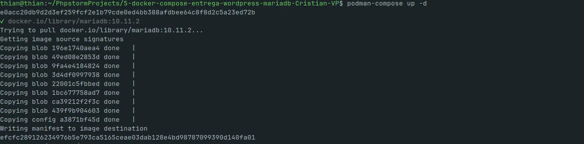
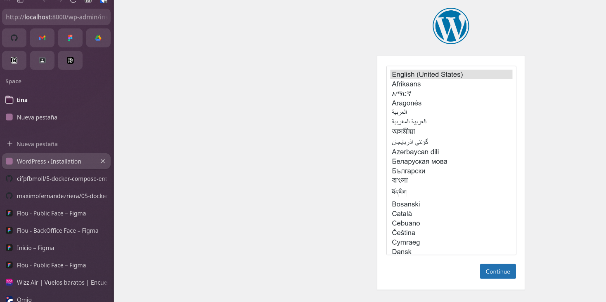
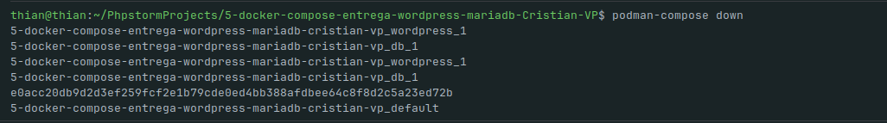
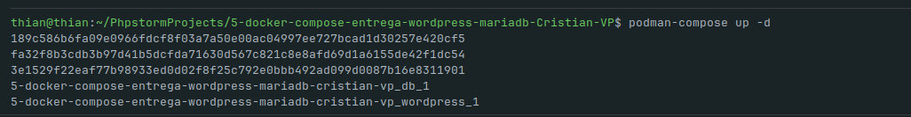

# WordPress + MariaDB con Docker Compose

## Introducción
Este repositorio contiene una práctica académica para desplegar WordPress con MariaDB usando `docker-compose.yml`. El objetivo es entender la configuración mínima necesaria para levantar un entorno local reproducible y ver, mediante capturas, el proceso de arranque, la pantalla de configuración inicial de WordPress y el apagado de los servicios.

## Estructura del proyecto
- `docker-compose.yml` — fichero con la definición de los servicios \(WordPress y MariaDB\).
- `screenshots/` — capturas realizadas durante la práctica que ilustran cada paso.

## Descripción del fichero `docker-compose.yml`
La configuración incluida define dos servicios principales:

- Servicio `db` (MariaDB):
    - Basado en la imagen `mariadb:10.11.2`.
    - Persistencia de datos a través del volumen `db_data`.
    - Variables de entorno relevantes: `MARIADB_ROOT_PASSWORD`, `MARIADB_DATABASE`, `MARIADB_USER`, `MARIADB_PASSWORD`.
    - Es recomendable contar con un mecanismo de comprobación de salud para asegurarse de que la base de datos está lista antes de que WordPress intente conectarse.

- Servicio `wordpress`:
    - Basado en una imagen de WordPress (se sugiere fijar una etiqueta concreta para reproducibilidad académica).
    - Mapeo de puerto para acceder desde el navegador.
    - Variables de entorno relevantes: `WORDPRESS_DB_HOST`, `WORDPRESS_DB_USER`, `WORDPRESS_DB_PASSWORD`, `WORDPRESS_DB_NAME`.
    - Depende del servicio `db` en orden de arranque; en entornos reales se recomienda coordinar con healthchecks.

## Notas sobre persistencia y dependencias
- El volumen `db_data` asegura que la información de la base de datos persista entre reinicios.
- `depends_on` controla el orden de inicio, pero no garantiza que la base de datos esté lista; usar healthchecks mejora la fiabilidad del arranque.

## Capturas realizadas
A continuación se incluyen las imágenes que documentan la práctica. 
### iniciando los servicios  
  
### Pantalla de configuración inicial de WordPress

  
### Deteniendo los servicios  

  
### Relanzando los servicios  

> Las imágenes muestran: descarga/arranque de imágenes y contenedores, la pantalla de configuración inicial de WordPress en el navegador y la salida de la terminal al detener los servicios.
